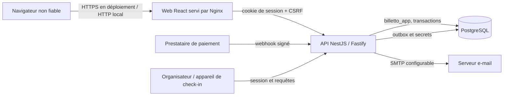

# Analyse d’architecture orientée sécurité

Cette analyse sert de garde-fou **avant de concevoir ou modifier une fonctionnalité**. Elle décrit les frontières de confiance de Billetto, les chemins sensibles et les invariants à préserver pour éviter qu’une décision d’architecture n’introduise une vulnérabilité. C’est une base de revue, pas une certification ni un audit d’exécution.

## Architecture observée

Le dépôt sépare le web (`apps/web`), l’API (`apps/api`) et les migrations PostgreSQL (`database/migrations`). L’API initialise les modules métier dans `apps/api/src/app.module.ts`; `DbContextService` associe les requêtes à un rôle PostgreSQL en liste blanche et à un identifiant utilisateur dans une transaction. La migration `005_security.sql` définit les rôles, privilèges, RLS et policies; les migrations suivantes étendent ce modèle aux réservations, au check-in, aux e-mails et aux webhooks.

### Actifs et frontières de confiance

| Actif | Menace principale | Frontière à protéger |
|---|---|---|
| Sessions, identifiants et rôles | vol, falsification, élévation de privilèges | navigateur → API → vérification du jeton → contexte SQL |
| Profil, commandes, billets et paiements | lecture/modification par un autre utilisateur ou tenant | API → transaction → rôle PostgreSQL + RLS |
| Quotas, réservations, remboursements | survente, double effet, course concurrente | requête HTTP/webhook → transaction et fonctions SQL atomiques |
| Secrets de webhook et check-in | usurpation de prestataire ou génération de faux billets | secret/configuration → vérification HMAC → traitement idempotent |
| E-mails et outbox | divulgation de données, envoi répété ou contenu non fiable | données DB → worker/API → SMTP |
| Comptes admin et configuration d’exploitation | compromission à fort impact | secrets d’environnement, comptes DB et accès d’administration |

Les clients et toutes les valeurs reçues par HTTP sont non fiables, même pour un utilisateur authentifié. Les rôles et identifiants transmis par le client ne doivent jamais constituer une preuve d’autorisation. Une transaction SQL n’est isolée que si son rôle et son contexte sont établis à l’intérieur de cette transaction et qu’ils ne persistent pas dans la connexion du pool.

## Invariants d’architecture à préserver

1. **Autorisation côté serveur et dans la base.** Les guards API améliorent les réponses et contrôlent l’accès aux fonctions, mais les politiques RLS et privilèges DB restent la barrière d’isolation des lignes. Toute nouvelle table contenant des données tenant/utilisateur doit avoir des privilèges minimaux, RLS forcée et policies couvertes par des tests inter-comptes.
2. **Contexte DB transactionnel.** Les requêtes métier passent par `DbContextService.run` (ou `asBuyer` pour les données acheteur). Rôle PostgreSQL et `app.user_id` sont positionnés localement à chaque transaction. Aucun rôle SQL ne doit être construit depuis une entrée HTTP. Examiner tout chemin qui utilise `raw()` ou sort de ce contexte.
3. **Fonctions privilégiées étroites.** Toute fonction `SECURITY DEFINER` doit avoir un `search_path` fixe, des objets qualifiés, des droits `EXECUTE` minimaux, un contrôle explicite de l’acteur et une surface de retour réduite. Le rôle propriétaire des migrations et le rôle runtime doivent rester distincts. La capacité de `billetto_app` à endosser le rôle admin est une frontière de confiance majeure : une compromission complète de l’API peut agir comme admin; la RLS protège surtout contre les erreurs de requête et l’accès direct avec des droits limités.
4. **Écritures métier atomiques.** Achat, réservation, confirmation webhook, remboursement, attribution de places et scan ne doivent pas être fragmentés en vérifications puis écritures indépendantes. Préserver transactions, verrous/contraintes, idempotence et contrôle d’identité lors de toute évolution.
5. **Sessions web protégées.** Le jeton de session reste inaccessible au JavaScript (cookie HttpOnly); les mutations exigent CSRF; vérifier rotation, expiration, révocation et attributs Secure/SameSite selon le mode de déploiement. Aucun secret d’autorisation ne doit être placé dans le stockage web.
6. **Entrées et sorties explicitement contrôlées.** Validation stricte côté API, requêtes SQL paramétrées, encodage d’affichage React et réponses minimales. Les champs de rôle, tenant, prix, statut ou propriétaire ne peuvent être acceptés que pour les rôles et cas métier prévus, puis vérifiés à nouveau côté serveur/DB.
7. **Effets externes authentifiés et rejouables sans danger.** Webhooks : vérifier la signature sur les octets bruts, comparer de manière sûre, borner la taille et dédupliquer l’identifiant d’événement dans la même transaction que l’effet métier. E-mail : sortie via outbox, contenu encodé, aucun secret ni détail sensible dans les logs.
8. **Configuration fail-closed.** Secrets requis validés au démarrage, environnements de démonstration isolés, cookies sécurisés en production, CORS restreint, interfaces DB/admin non exposées publiquement par défaut. Les valeurs d’exemple ne doivent pas devenir des secrets de production.
9. **Nouveaux chemins = nouveaux tests d’isolation.** Pour chaque endpoint et effet métier, couvrir au minimum anonyme, rôle autorisé, rôle non autorisé, propriétaire différent, ressource absente/invisible, concurrence/rejeu quand applicable et retour d’erreur sans fuite.

## Analyse à effectuer pour toute évolution

Avant de choisir les modules ou le schéma d’une fonctionnalité :

1. Définir l’actif, les acteurs légitimes, les données traitées, les opérations et les conséquences d’une fuite, altération, indisponibilité ou répudiation.
2. Tracer le flux complet depuis l’entrée non fiable jusqu’aux données et effets externes. Marquer chaque frontière, identité, changement de privilège, stockage et décision d’autorisation.
3. Énumérer les abus plausibles (usurpation, falsification, répudiation, divulgation, déni de service, élévation de privilèges) et les variantes multi-tenant, concurrence et rejeu.
4. Déterminer le contrôle qui bloque chaque abus, le point où il est imposé et le comportement en cas d’échec. Une validation UI ou un guard seul ne protège pas une donnée DB.
5. Vérifier que les autorisations sont définies par identité validée + action + ressource, et que les chemins secondaires (tâche, webhook, export, analytics, check-in) n’évitent pas le contrôle.
6. Spécifier invariants transactionnels, contraintes DB, idempotence et comportement en concurrence avant de définir les endpoints.
7. Décider quelles données sont persistées, retournées, journalisées, mises en cache ou conservées hors ligne. Minimiser les copies et définir leur durée de vie.
8. Ajouter au design des preuves de validation : tests positifs et négatifs, isolation entre deux comptes/organisateurs, tests de rejeu/concurrence et revue de configuration. Le plan de test est défini au design, exécuté selon le processus du projet.
9. Noter les risques résiduels, dépendances et hypothèses. Si une décision affaiblit un invariant ci-dessus, expliciter le mécanisme compensatoire avant d’implémenter.

## Questions de revue de conception

- Qui contrôle la donnée ou l’action, et comment cette identité est-elle obtenue et vérifiée ?
- Un identifiant substitué (IDOR), un rôle falsifié ou une requête sans session expose-t-il une ressource d’un autre compte/organisateur ?
- La base refuserait-elle l’accès si un contrôleur oubliait son filtre applicatif ? Les nouvelles tables sont-elles dans la matrice RLS et la suite d’isolation ?
- Une nouvelle fonction privilégiée élargit-elle les droits ou révèle-t-elle plus de données que nécessaire ?
- Un retry, deux requêtes simultanées ou un webhook rejoué peut-il produire un double effet ou dépasser un quota ?
- Un secret, jeton, e-mail ou donnée de paiement apparaît-il dans le navigateur, les logs, les erreurs, l’outbox ou les paramètres URL ?
- Le comportement reste-t-il sûr si un secret manque, une dépendance tombe, la transaction échoue ou le service est redémarré ?
- Les conteneurs, ports, reverse proxy et workflows CI exposent-ils une frontière d’administration ou une identité plus puissante que prévu ?
- Quelle preuve automatisée empêche la régression de chaque décision de sécurité ?

## Limites de cette analyse

Ce document formalise les frontières et exigences à partir du code et de la documentation actuellement présents. Il ne prouve pas le comportement réel des environnements déployés, des secrets, du réseau, des sauvegardes, du prestataire de paiement ou du serveur SMTP. Avant une mise en production, ces éléments nécessitent une revue de configuration et de menace liée au déploiement concret.
