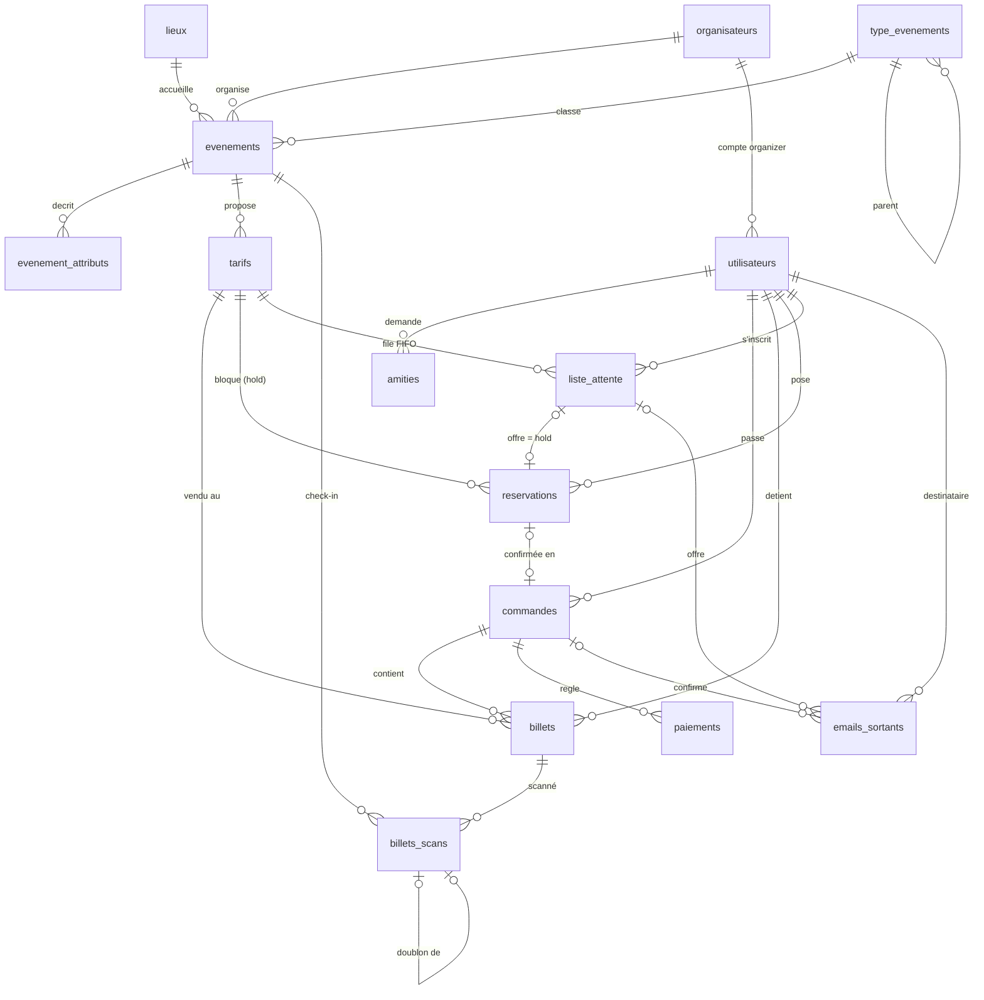

# Base de données

## Modèle



`journal_tarifs` n'a volontairement pas de clé étrangère : l'audit doit survivre à la suppression d'un tarif.
`checkin_secret` (une ligne, clé HMAC des QR) n'a aucune relation ni aucun droit applicatif.

**Tables par migration**

| Migration | Ajouts |
|-----------|--------|
| 001 | Schéma 3NF : `organisateurs`, `lieux`, `type_evenements`, `evenements`, `evenement_attributs`, `tarifs`, `utilisateurs`, `amities`, `commandes`, `billets`, `paiements`, `journal_tarifs` |
| 002 – 006 | Vues, index, fonctions/triggers, sécurité (rôles, RLS), objets de l'API (`places_restantes`) |
| 007 | `organisateurs.slug` (multi-tenant, phase 09) |
| 008 | `reservations` (hold + TTL, phase 10) |
| 009 | `places_occupees()` : règle de quota unique ; `commandes.statut` accepte `en_attente_virement` |
| 010 | `liste_attente` (phase 12) |
| 011 | `billets.code_verification`, `billets_scans`, `checkin_secret` (check-in, phase 13) |
| 012 | Vues étendues : réservé / liste d'attente / taux d'occupation (phase 14) |
| 013 | `evenements.delai_annulation`, `en_ligne`, `fuseau_horaire` ; `emails_sortants` (phase 15) |
| 014 | `paiement_webhooks` + `traiter_paiement_webhook()` : idempotence des webhooks de paiement (phase 11, numérotée après la 15 car livrée plus tard) |
| 015 | `utilisateurs.auth_version` et fonctions de changement de mot de passe / validation de version : révocation des sessions JWT |

## Normalisation
- **1FN** : valeurs atomiques, pas de listes dans une cellule (pas de `tags = 'vip,concert'`).
- **2FN** : toutes les tables ont une clé simple ; pas de dépendance partielle.
- **3FN** : la ville est portée par `lieux`, pas par `evenements` ; le nom de l'organisateur par `organisateurs`.
- **Écart assumé** : `billets.prix_paye` duplique le prix du tarif. Ce n'est pas une dépendance transitive : c'est le prix **au moment de l'achat**, qui doit rester figé si le tarif change.
- **Écart pédagogique** : `evenement_attributs` (voir ci-dessous).

## Contraintes
Tout ce que PostgreSQL peut garantir l'est de façon déclarative (pas de trigger quand une contrainte suffit) :

| Règle | Contrainte |
|-------|-----------|
| Prix, montants positifs | `ck_tarifs_prix_positive`, `ck_billets_prix_paye_positive`, `ck_commandes_montant_positive` |
| Quota strictement positif | `ck_tarifs_quota_positive` |
| Fin après début | `ck_evenements_fin_apres_debut`, `ck_tarifs_periode_vente` |
| Statuts valides | `ck_evenements_statut`, `ck_commandes_statut`, `ck_paiements_statut`, `ck_amities_statut` |
| Pas d'amitié avec soi-même | `ck_amities_pas_soi_meme` |
| Remboursement négatif, paiement positif | `ck_paiements_signe_montant` |
| Organizer ⇔ organisateur rattaché | `ck_utilisateurs_organisateur_coherent` |
| Un nom de tarif par événement | `uq_tarifs_evenement_id_nom` |
| Un type racine par nom | `uq_type_evenements_parent_id_nom` (`NULLS NOT DISTINCT`) |
| Hold : statut, mode de paiement, quantité 1–10, prix ≥ 0 | `ck_reservations_statut`, `ck_reservations_mode_paiement`, `ck_reservations_quantite`, `ck_reservations_prix_positive` |
| Une inscription vivante par personne et par tarif | `uq_liste_attente_inscription_active` (index unique partiel `WHERE statut IN ('en_attente','notifiee')`) |
| Une offre porte sa réservation et ses dates | `ck_liste_attente_offre` |
| **Un seul scan `ok` par billet** (doublon garanti en base) | `uq_billets_scans_billet_ok` (index unique partiel `WHERE resultat = 'ok'`) |
| Rejeu offline idempotent | `uq_billets_scans_client_scan_id` |
| Un doublon pointe vers le premier scan | `ck_billets_scans_doublon` |
| Jamais deux e-mails pour le même fait | `uq_emails_sortants_commande`, `uq_emails_sortants_liste_attente` |
| Délai d'annulation 0 à 30 jours | `ck_evenements_delai_annulation` |

Les règles dépendant d'autres lignes (quota restant, événement déjà commencé) ne sont pas exprimables par `CHECK` : elles relèvent de `acheter_billet()` et des triggers (voir plus bas).

## Index
Seuls existent en phase 01 les index créés par `PRIMARY KEY` et `UNIQUE`.
**PostgreSQL n'indexe pas automatiquement les clés étrangères** : `billets.tarif_id`, `billets.commande_id`, `commandes.utilisateur_id`… ne sont pas indexés. C'est voulu, pour mesurer l'effet des index en phase 03.

Depuis `003_indexes.sql` : `idx_billets_commande_id`, `idx_billets_tarif_id`, `idx_commandes_utilisateur_id`, `idx_paiements_commande_id`, `idx_evenements_debut` ; depuis 004 : `idx_billets_utilisateur_id`. Justification plan par plan : [performance.md](performance.md).

Phases 10 à 15, un index par requête chaude :
- `ix_reservations_tarif_actives (tarif_id, statut, expire_a)` : calcul de quota à chaque achat ou hold ;
- `ix_liste_attente_fifo (tarif_id, created_at, id) WHERE statut = 'en_attente'` : tête de file ;
- `ix_billets_scans_evenement_id (evenement_id, recu_a)` : suivi du check-in ;
- `ix_emails_sortants_a_envoyer (prochain_essai) WHERE statut = 'a_envoyer'` : lot du job d'envoi.

## Table `evenement_attributs` (EAV)
Modèle clé/valeur conservé volontairement, car le sujet l'identifie comme un « fourre-tout » à analyser.

```text
evenement_id | cle          | valeur
-------------+--------------+--------
42           | age_minimum  | 18
42           | parking      | oui
```

**Pourquoi c'est flexible** : ajouter un attribut ne demande aucune migration ; chaque événement peut avoir des attributs différents.

**Pourquoi c'est moins sain**
- Aucun typage : `age_minimum` est du texte ; `'dix-huit'` est accepté. Les comparaisons numériques demandent un cast qui peut échouer.
- Pas de contrainte par attribut (`NOT NULL`, `CHECK`, FK) ni de valeurs autorisées.
- Requêtes lourdes : filtrer sur deux attributs demande deux jointures (ou un pivot avec `FILTER`), et l'optimiseur estime mal la sélectivité.
- Les fautes de frappe dans `cle` créent silencieusement de nouveaux attributs.

**Validation en place** : `UNIQUE (evenement_id, cle)` (un attribut une seule fois par événement) et `CHECK` de format sur `cle` (`^[a-z][a-z0-9_]*$`). Depuis la migration 004, `trg_evenement_attributs_validate` valide les valeurs des clés connues : `age_minimum` entier 0–21, `parking` et `accessibilite_pmr` ∈ {oui, non}, pas de valeur vide ; les clés inconnues restent acceptées (`BT020`).

**Alternatives dans un produit réel**
- Colonnes typées pour les attributs connus (`age_minimum smallint CHECK (age_minimum BETWEEN 0 AND 21)`).
- Table de référence `attributs (cle, type, valeurs_autorisees)` + validation.
- Colonne `jsonb` avec index GIN et contrainte `CHECK (jsonb_typeof(...))`, ou validation par schéma JSON.

## Requêtes d'analyse (`database/queries/`)
| Fichier | Question | Outil démontré |
|---------|----------|----------------|
| q1 | Ventes et CA par événement | CTE + `LEFT JOIN` (événements sans vente conservés) |
| q2 | Événements sans vente | `NOT EXISTS` ; piège `NOT IN` avec `NULL` |
| q3 | Taux de remplissage | Deux CTE agrégés séparément (évite le fan-out) |
| q4 | CA par lieu | `LEFT JOIN` en chaîne, filtre dans le `ON` et non le `WHERE` |
| q5 | Ventes quotidiennes | Agrégat par jour (fuseau Europe/Paris) |
| q6 | Utilisateurs sans commande | `LEFT JOIN … COUNT(c.id) = 0` vs `COUNT(*)` corrélé vs `NOT EXISTS` |
| q7 | CA par ville et type racine | `WITH RECURSIVE` + agrégats `FILTER (WHERE …)` |
| q8 | Arbre des types | `WITH RECURSIVE` : ancre, `UNION ALL`, niveau, chemin, garde-fous |

Une **vente** est un billet appartenant à une commande `paid`.

### Pièges démontrés
- **`NOT IN` + `NULL`** : `id NOT IN (SELECT parent_id FROM type_evenements)` renvoie 0 ligne car les racines ont `parent_id = NULL` (`x <> NULL` est inconnu). `NOT EXISTS` renvoie les 12 feuilles.
- **`COUNT(*)` après `LEFT JOIN`** : compte la ligne de `NULL` produite par la jointure, donc vaut 1 au minimum. Il faut `COUNT(c.id)`.
- **Filtre dans le `WHERE` d'un `LEFT JOIN`** : `WHERE c.statut = 'paid'` élimine les lignes sans correspondance et transforme la jointure en `INNER JOIN`.

## Vues (`002_views.sql`)

```text
v_ventes_par_evenement          (tous les événements, billets vendus, CA)
 ├── v_remplissage              (places = Σ quotas des tarifs actifs, taux)
 └── v_classement_lieux         (CA par lieu, rang global et par ville)

mv_ventes_quotidiennes          (jour, commandes, billets, ca) — matérialisée
```

**Dépendances** : `DROP VIEW v_ventes_par_evenement` échoue (`2BP01 dependent_objects_still_exist`) tant que les vues filles existent. `DROP … CASCADE` les supprimerait silencieusement. `CREATE OR REPLACE VIEW` n'autorise qu'à ajouter des colonnes en fin de liste : renommer ou retirer une colonne impose de recréer la chaîne dans une migration.

### Vue ou vue matérialisée ?
| | Vue | Vue matérialisée |
|---|---|---|
| Stockage | Aucun, requête réexécutée à chaque lecture | Résultat stocké sur disque |
| Fraîcheur | Toujours à jour | Figée jusqu'au `REFRESH` |
| Coût en lecture | Celui de la requête (agrégats sur 1,8 M billets) | Lecture d'une petite table indexable |
| Usage ici | Écrans organisateur (doivent refléter un achat immédiatement) | Graphique des ventes quotidiennes (quelques minutes de retard acceptables) |

**Rafraîchissement**
- `REFRESH MATERIALIZED VIEW mv_ventes_quotidiennes` : reconstruit la vue sous verrou `ACCESS EXCLUSIVE` ; les lectures sont bloquées pendant le calcul.
- `REFRESH MATERIALIZED VIEW CONCURRENTLY` : calcule le nouveau résultat à côté puis applique la différence ; les lectures continuent. Plus lent, et **exige un index `UNIQUE`** sans `WHERE` couvrant toutes les lignes : `uq_mv_ventes_quotidiennes_jour`. Impossible sur une MV jamais peuplée.
- Commandes : `pnpm db:refresh-mv` (concurrent) ou `pnpm db:refresh-mv --blocking`. Le seed rafraîchit la MV automatiquement. En production : tâche planifiée (cron / pg_cron) toutes les N minutes.

Le test `database/tests/phase02_requetes_vues.sql` montre qu'après un achat la vue change immédiatement, la MV seulement après `REFRESH`.

## Fonctions, procédure, triggers (`004_functions_triggers.sql`)

### Fonctions et procédure
| Objet | Type | Rôle |
|-------|------|------|
| `ca_evenement(evenement_id)` | `sql STABLE` | CA d'un événement (commandes `paid`), 0 sinon. Intégrable (inlining) par le planner. |
| `billets_utilisateur(utilisateur_id)` | `sql STABLE`, `RETURNS TABLE` | Billets d'un utilisateur avec événement, lieu, tarif, statut. S'appuie sur `idx_billets_utilisateur_id` (B10 : 129 → 1,2 ms). |
| `acheter_billet(utilisateur_id, tarif_id, quantite)` | `plpgsql`, `SECURITY DEFINER` | **Seul chemin de création d'un achat.** Renvoie `commande_id, paiement_id, billet_ids, montant_total`. |
| `rembourser_commande(commande_id)` | `PROCEDURE` | Commande `paid` avant le début de l'événement → paiement `refund` négatif + statut `refunded`. |

Pourquoi une **procédure** pour le remboursement : c'est une action sans résultat à renvoyer (`CALL`), qui pourrait à terme gérer ses propres transactions (`COMMIT` intermédiaires, impossibles dans une fonction). L'achat est une **fonction** car l'appelant a besoin des identifiants créés.

### `acheter_billet` pas à pas
1. Quantité entre 1 et 10 (`BT007`), utilisateur existant (`BT008`).
2. `SELECT … FROM tarifs WHERE id = … FOR UPDATE` : **verrou de ligne sur le tarif**.
3. Tarif existant (`BT001`) et actif (`BT002`) ; événement `published` (`BT003`), pas commencé (`BT005`) ; `now()` dans la période de vente (`BT004`).
4. Places occupées = `places_occupees(tarif)` (depuis 009) : billets des commandes `paid` ou `pending` **plus** les holds `active` dont `expire_a > now()` (offres de liste d'attente comprises). Si `occupées + quantité > quota` → `BT006`. La même fonction sert à `creer_reservation`, `places_restantes` et à la liste d'attente : une seule règle de quota.
5. `INSERT` commande `paid`, paiement `charge` `succeeded` (paiement simulé), billets (`generate_series`).
6. Toute erreur annule l'ensemble : la fonction s'exécute dans la transaction de l'appelant, atomiquement.

**Pourquoi le verrou.** Sans lui, deux sessions lisent « 1 place restante » au même instant et chacune insère : survente. `FOR UPDATE` sérialise les acheteurs **d'un même tarif** : la seconde session attend la fin de la première, puis recompte en voyant la vente validée (en `READ COMMITTED`, chaque requête voit les données validées avant son démarrage). Les achats sur des tarifs différents restent parallèles.

`database/scripts/concurrency.mjs` le démontre avec 40 sessions simultanées sur un quota de 10 :

```text
acheter_billet (FOR UPDATE) : 10 succès, 30 refus BT006, 10 billets en base
version naïve (sans verrou) : 40 succès, 0 refus BT006, 40 billets en base
```

Alternatives écartées : compteur dénormalisé `UPDATE tarifs SET restant = restant - n WHERE restant >= n` (à maintenir lors des remboursements) ; isolation `SERIALIZABLE` (correcte, mais impose à l'API de rejouer les transactions en échec `40001`).

### Codes d'erreur
Table complète, identique à `apps/api/src/common/errors/pg-errors.ts` (HTTP et code d'erreur renvoyés par l'API).

| SQLSTATE | Signification | HTTP | Code API | Depuis |
|----------|---------------|------|----------|--------|
| `BT001` | Tarif introuvable | 404 | `TARIF_INTROUVABLE` | 004 |
| `BT002` | Tarif inactif | 409 | `TARIF_INACTIF` | 004 |
| `BT003` | Événement non publié | 409 | `EVENEMENT_NON_PUBLIE` | 004 |
| `BT004` | Vente fermée | 409 | `VENTE_FERMEE` | 004 |
| `BT005` | Événement déjà commencé | 409 | `EVENEMENT_COMMENCE` | 004 |
| `BT006` | Quota épuisé | 409 | `QUOTA_EPUISE` | 004 |
| `BT007` | Quantité invalide | 422 | `QUANTITE_INVALIDE` | 004 |
| `BT008` | Utilisateur introuvable | 404 | `UTILISATEUR_INTROUVABLE` | 004 |
| `BT010` | Commande introuvable | 404 | `COMMANDE_INTROUVABLE` | 004 |
| `BT011` | Commande non remboursable (statut) | 409 | `COMMANDE_NON_REMBOURSABLE` | 004 |
| `BT012` | Remboursement après le début de l'événement | 409 | `REMBOURSEMENT_IMPOSSIBLE` | 004 |
| `BT013` | Action pour le compte d'un autre / hors de son collectif / contexte absent | 403 | `ACTION_INTERDITE` | 005 |
| `BT014` | Délai d'annulation self-service dépassé | 409 | `DELAI_ANNULATION_DEPASSE` | 013 |
| `BT015` | Fuseau horaire inconnu | 422 | `FUSEAU_INVALIDE` | 013 |
| `BT020` | Attribut d'événement invalide | 422 | `ATTRIBUT_INVALIDE` | 004 |
| `BT030` | Mode de paiement invalide | 422 | `MODE_PAIEMENT_INVALIDE` | 008 |
| `BT031` | Réservation introuvable | 404 | `RESERVATION_INTROUVABLE` | 008 |
| `BT032` | Réservation non active (déjà confirmée, annulée…) | 409 | `RESERVATION_NON_ACTIVE` | 008 |
| `BT033` | Réservation expirée | 409 | `RESERVATION_EXPIREE` | 008 |
| `BT040` | Places disponibles : inscription en liste d'attente inutile | 409 | `PLACES_DISPONIBLES` | 010 |
| `BT041` | Inscription en liste d'attente introuvable | 404 | `INSCRIPTION_INTROUVABLE` | 010 |
| `BT042` | Déjà inscrit en liste d'attente | 409 | `DEJA_INSCRIT` | 010 |
| `BT043` | Aucune offre active (expirée, non notifiée, close) | 409 | `OFFRE_INACTIVE` | 010 |
| `BT050` | Événement introuvable (check-in, export) | 404 | `EVENEMENT_INTROUVABLE` | 011 |
| `BT051` | Contenu de QR vide | 422 | `QR_VIDE` | 011 |

L'API s'appuie sur le code, jamais sur le texte du message.

**Écart assumé avec le TODO de la phase 16**, qui proposait `BT030` réservation expirée, `BT031` liste d'attente fermée, `BT032` doublon de scan et `BT033` webhook dupliqué. Ces numéros étaient déjà attribués depuis la phase 10 et l'API, le front et les tests en dépendent : ils n'ont pas été renumérotés.
- La réservation expirée est `BT033`, la liste d'attente fermée `BT043`.
- Un **doublon de scan n'est pas une erreur** : c'est un résultat enregistré (`billets_scans.resultat = 'doublon'`, avec le premier scan), renvoyé en 200 pour que le contrôleur voie qui est déjà entré.
- Un **webhook dupliqué n'est pas une erreur** non plus : `traiter_paiement_webhook` l'ignore (`INSERT … ON CONFLICT DO NOTHING` sur `evenement_externe_id`) et l'API répond 200, comme l'attend un prestataire qui rejoue.

### Triggers
| Trigger | Table | Moment | Rôle |
|---------|-------|--------|------|
| `trg_billets_validate_date` | `billets` | `BEFORE INSERT`, ligne | Refuse un billet dont `created_at ≥ debut` de l'événement (`BT005`). |
| `trg_tarifs_audit_update` | `tarifs` | `AFTER UPDATE OF prix, quota`, ligne, `WHEN` changement réel | Ancienne/nouvelle valeur → `journal_tarifs`. |
| `trg_tarifs_audit_delete` | `tarifs` | `AFTER DELETE`, ligne | Suppression → `journal_tarifs`. |
| `trg_<table>_updated_at` | `organisateurs`, `lieux`, `evenements`, `tarifs`, `utilisateurs`, `commandes` | `BEFORE UPDATE`, ligne, `WHEN (OLD IS DISTINCT FROM NEW)` | Maintient `updated_at`. |
| `trg_evenement_attributs_validate` | `evenement_attributs` | `BEFORE INSERT OR UPDATE`, ligne | Valide les clés EAV connues (`BT020`). |
| `trg_reservations_updated_at`, `trg_liste_attente_updated_at` | `reservations`, `liste_attente` | `BEFORE UPDATE` | Maintient `updated_at`. |
| `trg_commandes_liberation` | `commandes` | `AFTER UPDATE OF statut` (→ `refunded`/`cancelled`) | Désistement : `traiter_liste_attente` sur les tarifs de la commande. |
| `trg_reservations_liberation` | `reservations` | `AFTER UPDATE OF statut` (→ `annulee`/`expiree`) | Hold rendu : `traiter_liste_attente`. |
| `trg_billets_code_verification` | `billets` | `BEFORE INSERT OR UPDATE OF code, code_verification` | Signature HMAC du QR, toujours recalculée. |
| `trg_evenements_fuseau` | `evenements` | `BEFORE INSERT OR UPDATE OF fuseau_horaire` | Fuseau IANA connu de `pg_timezone_names` (`BT015`). |
| `trg_commandes_email_insert`, `trg_commandes_email_update` | `commandes` | `AFTER INSERT` / `AFTER UPDATE OF statut` (→ `paid`) | E-mail de confirmation mis en file (outbox). |
| `trg_liste_attente_email` | `liste_attente` | `AFTER UPDATE OF statut` (→ `notifiee`) | E-mail « une place vous attend » mis en file. |

**Choix de conception**
- **Contrainte d'abord, trigger ensuite.** « Événement commencé » dépend d'une autre table : aucun `CHECK` ne peut l'exprimer, d'où le trigger. Ce qui est local à la ligne reste en `CHECK` (001).
- **Le trigger de date double `acheter_billet` volontairement** : la fonction donne une erreur métier claire en amont, le trigger protège la table contre toute autre écriture.
- **`created_at` et non `now()`** : le seed insère des ventes historiques datées avant leur événement ; comparer à `now()` refuserait tout billet d'un événement passé. En phase 05, seule `acheter_billet` (qui laisse `created_at = now()`) pourra écrire dans `billets`.
- **Audit en deux triggers** : `WHEN` ne peut pas référencer `NEW` pour un `DELETE`. Le `WHEN` évite une ligne d'audit pour `UPDATE tarifs SET nom = …` ou `SET prix = prix`.
- **`journal_tarifs.auteur`** = `app.user_id` s'il est transmis par l'API (phase 05), sinon le rôle de connexion (`session_user`, et non `current_user`, qui vaudrait le propriétaire dans une fonction `SECURITY DEFINER`).
- **Pas de `updated_at` sur `billets` ni `paiements`** : lignes immuables, et tables les plus écrites.
- **Le seed vide `journal_tarifs`** après le calcul initial des quotas, qui n'est pas une modification métier.

**Coût d'un trigger ligne.** Insertion de 200 000 billets dans une transaction annulée (seed FULL, Docker Desktop) :

| | Mesure 1 | Mesure 2 |
|---|---:|---:|
| Sans `trg_billets_validate_date` | 64,3 s | 42,8 s |
| Avec | 99,2 s | 56,6 s |

Soit environ +30 à +50 % : une recherche `tarifs → evenements` par ligne insérée, en plus des 3 triggers internes de clés étrangères (`calls=200000` chacun dans le plan). Négligeable pour un achat (1 à 10 billets), sensible pour un chargement massif : le seed FULL passe de 11–12 min (phase 01, sans index ni trigger) à 15,5 min (6 index sur `billets` + trigger). Pour un import ponctuel : désactiver le trigger (`ALTER TABLE … DISABLE TRIGGER`, droits de propriétaire) après une validation ensembliste préalable.

## Réservations, liste d'attente, check-in, dashboard, e-mails (007 – 013)
Le détail de chaque phase est dans [phases/](phases/README.md). Les principes communs :

- **Un seul verrou, une seule règle de quota.** Achat direct (`acheter_billet`), hold (`creer_reservation`) et offre de liste d'attente (`notifier_prochain_en_attente`) prennent tous `FOR UPDATE` sur la ligne du tarif, puis comptent avec `places_occupees()`. Une réservation compte tant que `expire_a > now()` : l'expiration est **lazy**, elle ne dépend d'aucun job. La purge (`purger_reservations_expirees`) ne fait que du reporting.
- **Liste d'attente** : une offre est une réservation à TTL court, donc bloquée par la même règle et confirmée par `confirmer_reservation`. Le **déclencheur canonique unique** est `traiter_liste_attente(tarif)`. Il est idempotent : il recalcule tout sous verrou, ce qui empêche une double offre pour une même place. Il est appelé par les triggers de désistement et par un balayage périodique, qui rattrape les expirations lazy. L'ordre est FIFO strict (`ORDER BY created_at, id … FOR UPDATE SKIP LOCKED`).
- **Check-in** :
  - le doublon est garanti par l'index unique partiel `uq_billets_scans_billet_ok` ; une `unique_violation` est convertie en scan `doublon` relié au premier ;
  - les rejeux offline sont idempotents grâce à `client_scan_id UNIQUE` ;
  - QR signé (HMAC) avec une clé que seules les fonctions SECURITY DEFINER lisent.
- **Dashboard temps réel** : `v_ventes_par_evenement` et `v_remplissage` gagnent `billets_reserves`, `places_liste_attente` et `taux_occupation`. Les colonnes sont ajoutées **en fin de liste**, et `security_invoker` est répété (`CREATE OR REPLACE VIEW` réinitialise les options).
- **Outbox d'e-mails** : `emails_sortants` est remplie par trigger dans la transaction métier, ce qui exclut tout e-mail pour un achat annulé. Elle est vidée par le job API via `emails_a_envoyer` (`SKIP LOCKED` + bail de 5 min) et `marquer_email` (backoff, échec après 5 tentatives).
- **Règle multi-tenant (phase 09)** : chaque nouvelle table reçoit sa RLS (`ENABLE` + `FORCE`) dans sa migration de création. Le test `phase16_isolation.sql` le vérifie table par table, avec un garde-fou générique : toute table lisible par un rôle visiteur ou organisateur sans RLS forcée fait échouer la suite.

## Sécurité (`005_security.sql`)
Rôles, `GRANT`/`REVOKE`, `SECURITY DEFINER`, RLS et vues `security_invoker` : voir [security.md](security.md).
Nouveau code d'erreur : `BT013` (action pour le compte d'un autre utilisateur, ou contexte `app.user_id` absent) → HTTP 403.

## Migrations et seed
```bash
pnpm db:migrate        # applique les nouvelles migrations
pnpm db:reset          # DROP SCHEMA public puis réapplique tout
pnpm db:seed:small     # ~10 000 billets, quelques secondes
pnpm db:seed:full      # 1 800 000 billets
pnpm db:test           # tests SQL + concurrence (tout est annulé par ROLLBACK)
pnpm db:refresh-mv     # rafraîchir la vue matérialisée
SEED=42 pnpm db:seed:small   # autre graine
```
## Stratégie de tests

| Niveau | Commande | Contenu |
|--------|----------|---------|
| SQL | `pnpm db:test` | `database/tests/phase*.sql` (BEGIN … ROLLBACK) : règles métier, erreurs BT, RLS, isolation multi-tenant (`phase09`, `phase16_isolation`), puis les requêtes d'analyse et la connexion réelle `billetto_app`. |
| Concurrence | (inclus dans `db:test`) | `database/scripts/concurrency.mjs` : 40 sessions PostgreSQL réelles. Achat avec ou sans verrou, holds, hold expiré, achat sur tarif réservé, purge, balayage concurrent de la liste d'attente, scans simultanés, lectures du dashboard sous charge. |
| Unitaires | `pnpm test` | API (Jest) et web (Vitest) : validation, erreurs, CSV, e-mails, fuseaux… |
| e2e API | `pnpm test:e2e` | API NestJS complète sur la vraie base, connectée en `billetto_app`. |
| Charge | `pnpm test:load` | `apps/api/test/load.load-spec.ts` : holds, confirmations, liste d'attente, désistements, expirations et achats concurrents sur un tarif à quota 10, via l'API. Invariants : jamais de survente, FIFO strict, dashboard et outbox égaux à la base. Taille : `LOAD_USERS`. |

La CI (`.github/workflows/ci.yml`) enchaîne lint, types, tests unitaires et build, puis, sur une base PostgreSQL vierge : migrations, seeds, `db:test`, `test:e2e` et `test:load`.

Empreinte de contrôle du déterminisme :
```bash
docker compose exec -T postgres sh -c 'psql -At -U $POSTGRES_USER -d $POSTGRES_DB -f /database/scripts/checksum.sql'
```
